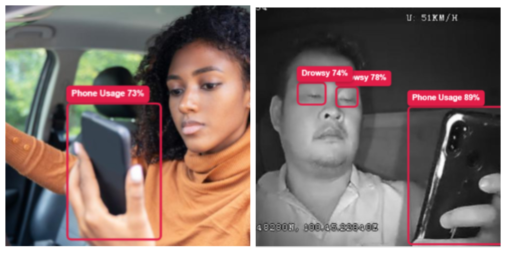

# Driver Monitoring System



[](https://driver-monitoring.vercel.app/)
[](https://www.python.org/downloads/)
[](LICENSE)

> An AI-powered real-time driver monitoring system that detects unsafe driving behaviors to enhance road safety.

## Quick Links

- **Live Demo:** [https://driver-monitoring.vercel.app/](https://driver-monitoring.vercel.app/)
- **Repository:** [https://github.com/AlbatrossC/Driver-Monitoring-System](https://github.com/AlbatrossC/Driver-Monitoring-System)

---

## Project Overview

The **Driver Monitoring System (DMS)** is an AI-based solution designed to detect unsafe driving behaviors in real-time. Using computer vision and deep learning, the system identifies critical safety violations including:

- **Drowsiness detection**
- **Phone usage while driving**
- **Eating and drinking**
- **Smoking**
- **Seatbelt violations**
- **Driver distraction**

The system is optimized to run directly in the browser using lightweight object detection models, making it accessible and efficient.

---

## Models Used

We developed **three distinct models** for comprehensive driver behavior analysis:

### YOLO Models (Object Detection)

| Model | Description | Status |
|-------|-------------|--------|
| **YOLOv8n** | Fast and lightweight object detection | ✅ Deployed in browser |
| **YOLO11n** | Improved accuracy with better class separation | ✅ Deployed in browser |

### CNN Model (Image Classification)

| Model | Description | Status |
|-------|-------------|--------|
| **Custom CNN** | Deep learning model for behavior classification | ⚠️ Local deployment only |

### Live Demo Note

The **browser-based demo** runs only the **YOLO models** due to performance constraints. The CNN model is too large and memory-intensive for browser deployment.

**To run the CNN model locally:**

```bash
git clone https://github.com/AlbatrossC/Driver-Monitoring-System
cd Driver-Monitoring-System
python app.py
```

---

## Data Sources

### Dataset 1: Soham Jadhav - Roboflow Dataset

**Link:** [Driver Monitoring System Dataset](https://app.roboflow.com/dataset-b2ns9/driver-monitoring-system-v0mei-mpvgx/1)

**Classes (8):**
- `0:` Distracted
- `1:` Drinking
- `2:` Drowsy
- `3:` Eating
- `4:` PhoneUse
- `5:` SafeDriving
- `6:` Seatbelt
- `7:` Smoking

### Dataset 2: Chaitanya kulkarni - Roboflow Universe Dataset

**Link:** [Abnormal Driver Behaviour Dataset](https://universe.roboflow.com/university-exrks/abnormal-driver-behaviour)

**Classes:**
- Cigarette
- Drinking
- Eating
- Phone
- Seatbelt

### Dataset 3: Divyanshu Mishra - Kaggle Dataset

**Link:** [Multi-Class Driver Behavior Image Dataset](https://www.kaggle.com/datasets/arafatsahinafridi/multi-class-driver-behavior-image-dataset)

**Classes:**
- other_activities
- safe_driving
- talking_phone
- texting_phone
- turning

---

## Data Processing & Training

All datasets underwent rigorous preprocessing:

- Data cleaning and structuring
- Data augmentation for improved model generalization
- Class balancing to handle imbalanced datasets
- YOLO annotation format conversion
- Separate training pipelines for each model

### Training Notebooks

All training notebooks are located in the `training_notebooks/` folder:

```
training_notebooks/
├── 1_soham_yolo11.ipynb      # YOLO11 model training
├── 2_chaitanya_yolo8.ipynb   # YOLOv8 model training
└── 3_divyanshu_cnn.ipynb     # CNN model training
```

### To Rerun the Notebooks:

1. Download the datasets manually from the links provided above
2. Update dataset paths in each notebook
3. Execute cells sequentially

---

## Project Structure

```
Driver-Monitoring-System/
│
├── data/                    # Raw and processed datasets
├── demo-images/             # Sample output images
├── driver_monitoring/       # Core ML logic and utilities
├── driver_monitor_sys/      # Experimental modules
├── models/                  # Trained YOLO & CNN models
├── public/                  # Public frontend assets
├── resources/               # Supporting resources
├── runs/                    # YOLO auto-generated outputs
├── static/                  # CSS, JS, images
├── templates/               # HTML templates (Flask)
├── testing_notebooks/       # Model testing and evaluation
├── training_notebooks/      # Model training notebooks
│
├── app.py                   # Main Flask application
├── convert.py               # Model conversion utilities
├── requirements.txt         # Python dependencies
├── vercel.json              # Deployment configuration
└── README.md                # Project documentation
```

---

## Installation & Setup

### Prerequisites

- Python 3.8 or higher
- pip package manager
- Git

### Installation Steps

1. **Clone the repository:**
   ```bash
   git clone https://github.com/AlbatrossC/Driver-Monitoring-System
   cd Driver-Monitoring-System
   ```

2. **Install dependencies:**
   ```bash
   pip install -r requirements.txt
   ```

3. **Run the application:**
   ```bash
   python app.py
   ```

4. **Access the application:**
   
   Open your browser and navigate to `http://localhost:5000`

---

## Usage

### Browser-Based Demo

1. Visit the [live demo](https://driver-monitoring.vercel.app/)
2. Upload an image
3. The system will automatically detect and highlight unsafe behaviors

### Local Deployment (All Models)

Run the Flask application locally to access all three models including the CNN classifier:

```bash
python app.py
```

---

## Team & Contributions

This project was developed as part of the **Advanced Course on Green Skills and Artificial Intelligence** under the **Skills4Future Program**.

### Team Members

| Name | Contribution |
|------|--------------|
| **Chaitanya kulkarni** | YOLOv8 Model Training & Dataset Preparation |
| **Soham Jadhav** | YOLO11 Model Training & Data Annotation |
| **Divyanshu Mishra** | CNN Model Training & Image Classification |
| **Anurag Pawar** | Backend Logic & System Integration |

### Program Details

- **Program:** Advanced Course on Green Skills and Artificial Intelligence
- **Organized by:** Edunet Foundation, AICTE, Shell India Markets Pvt. Ltd.
- **Mentor:** Professor Sarthak Narnor

---

## Model Performance

| Model | Accuracy | Speed | Deployment |
|-------|----------|-------|------------|
| YOLOv8n | High | Fast | ✅ Browser |
| YOLO11n | Very High | Fast | ✅ Browser |
| Custom CNN | Low | Moderate | 🖥️ Local Only |

---

## License

This project is licensed under the MIT License - see the [LICENSE](LICENSE) file for details.

---

## Acknowledgments

Special thanks to:
- Edunet Foundation, AICTE, and Shell India Markets Pvt. Ltd. for organizing the Skills4Future Program
- Professor Sarthak Narnor for mentorship and guidance
- The open-source community for providing datasets and tools